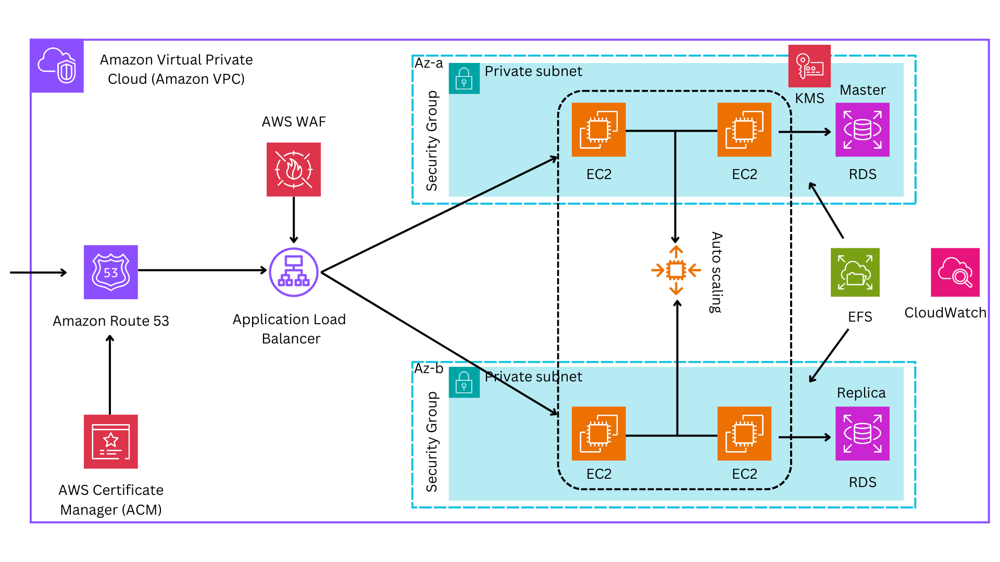

**AWS Architecture with Terraform**



---

## Table of Contents

- [Table of Contents](#table-of-contents)
- [Introduction](#introduction)
- [Prerequisites](#prerequisites)
- [Architecture Overview](#architecture-overview)
- [Core Components](#core-components)
- [Folder Structure](#folder-structure)
- [Deployment Steps](#deployment-steps)
- [Terraform Resources Reference](#terraform-resources-reference)
- [Cleanup](#cleanup)
- [License](#license)

---

## Introduction

This repository demonstrates how to deploy a highly available, secure, and monitored web application infrastructure on AWS using Terraform. By following Infrastructure-as-Code (IaC) principles, you can provision and manage resources in a consistent, repeatable manner.

## Prerequisites

* **Terraform v1.4+** installed and configured
* **AWS CLI** configured with appropriate IAM permissions
* An **existing Route 53** hosted zone or permission to create one
* Basic familiarity with AWS services (VPC, EC2, RDS, ALB, etc.)

## Architecture Overview


Our target design spans multiple Availability Zones for resilience and includes:

* **DNS**: Managed by Route 53
* **Load Balancing**: Application Load Balancer (ALB) with HTTPS and health checks
* **Security**: SSL/TLS via AWS Certificate Manager & WAF for web protection
* **Compute**: EC2 instances launched from a launch template, Auto Scaling Group (ASG)
* **Storage**: Amazon EFS for shared file storage and Amazon RDS (Multi-AZ)
* **Networking**: VPC with public/private subnets, NAT Gateway
* **Monitoring**: CloudWatch metrics, alarms, and log groups

## Core Components

1. **DNS (Route 53)**

   * Hosted zone and record sets for your domain (A/AAAA, CNAME).

2. **Networking (VPC, Subnets, NAT)**

   * VPC with public and private subnets across two AZs.
   * Internet Gateway for public subnets; NAT Gateway for private outbound traffic.

3. **Security Groups**

   * ALB, EC2, RDS, and EFS each have their own security groups with least-privilege rules.

4. **Certificate Management (ACM)**

   * Request and validate SSL/TLS certificates tied to your domain.

5. **Load Balancer (ALB)**

   * Public-facing ALB with HTTP→HTTPS redirect, target groups, and health checks.

6. **Web Application Firewall (WAF)**

   * Web ACL protecting the ALB from OWASP Top 10 attacks and IP blacklists.

7. **Compute (EC2 + ASG)**

   * Launch template defining instance type, AMI, tags, IAM role (with SSM access).
   * ASG spans two AZs with dynamic scaling policies based on CPU utilization.

8. **Storage**

   * **EFS**: Shared, persistent file system mounted by web servers.
   * **RDS**: Multi-AZ PostgreSQL (or MySQL) with automated backups and encryption.

9. **Monitoring & Alerting (CloudWatch)**

   * Metrics dashboard, alarms for high CPU, unhealthy hosts, and RDS failovers.

10. **Infrastructure as Code (Terraform)**

    * Modular Terraform configuration across multiple `.tf` files.

## Folder Structure

```
├── Architecture/
│   └── AWS-Architecture-Using-Terraform.png   # Diagram
├── template/
│   └── user_data.tpl                         # EC2 user-data script
├── README.md                                 # This document
├── provider.tf                               # AWS provider and backend
├── backend.tf                                # Remote state configuration
├── variables.tf                              # Input variables
├── terraform.tfvars                          # Variable values (ignored by Git)
├── local.tf                                  # Local values
├── vpc.tf                                    # VPC, subnets, IGW, NAT
├── route53.tf                                # DNS zone & record sets
├── alb.tf                                    # Load balancer & listeners
├── autoscaling.tf                            # EC2 launch template & ASG
├── ec2-launch-template.tf                    # Instance config
├── efs.tf                                    # EFS filesystem & mount targets
├── rds.tf                                    # RDS instance & subnet group
├── WAF.tf                                    # WAF ACL & rules
├── cloudwatch.tf                             # CloudWatch alarms & log groups
├── output.tf                                 # Terraform outputs
└── README.md
```

## Deployment Steps

1. **Init & Validate**

   ```bash
   terraform init
   terraform validate
   ```
2. **Plan**

   ```bash
   terraform plan -out=tfplan
   ```
3. **Apply**

   ```bash
   terraform apply tfplan
   ```
4. **Verify**

   * Check Route 53 records
   * Visit ALB DNS name over HTTPS
   * Monitor CloudWatch dashboards

## Terraform Resources Reference

| Resource Type                                           | Description                                                  |
| ------------------------------------------------------- | ------------------------------------------------------------ |
| `aws_route53_zone`                                      | DNS hosted zone                                              |
| `aws_route53_record`                                    | DNS record sets (A, CNAME, validation)                       |
| `aws_vpc`                                               | Virtual Private Cloud                                        |
| `aws_subnet`                                            | Public / Private subnets                                     |
| `aws_internet_gateway`, `aws_nat_gateway`               | Internet & NAT gateways                                      |
| `aws_security_group`                                    | Security groups for ALB, EC2, RDS, EFS                       |
| `aws_acm_certificate`, `aws_acm_certificate_validation` | SSL/TLS certificates                                         |
| `aws_lb`, `aws_lb_listener`, `aws_lb_target_group`      | Application Load Balancer and listeners                      |
| `aws_wafv2_web_acl`, `aws_wafv2_web_acl_association`    | WAF ACL & association                                        |
| `aws_launch_template`, `aws_autoscaling_group`          | EC2 launch template & Auto Scaling Group                     |
| `aws_efs_file_system`, `aws_efs_mount_target`           | EFS persistent storage                                       |
| `aws_db_instance`, `aws_db_subnet_group`                | RDS instance & subnet grouping                               |
| `aws_cloudwatch_metric_alarm`                           | CloudWatch alarms (CPU, unhealthy hosts, RDS failover, etc.) |
| `aws_ssm_parameter`                                     | Parameter store for secrets (e.g., DB password)              |
| `random_password`                                       | Random root/admin password generation                        |

For a complete list (including IAM roles, policies, and data sources), see [Terraform AWS Provider Docs](https://registry.terraform.io/providers/hashicorp/aws/latest/docs).

## Cleanup

To destroy all resources:

```bash
terraform destroy -auto-approve
```

## License

This project is licensed under the MIT License. See [LICENSE](LICENSE) for details.
